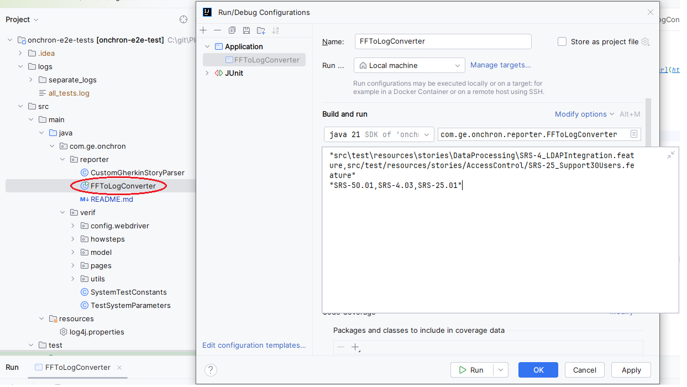

# Feature file to log file converter

This tool can be used to generate log file from feature files. \
The generated log file contains the test cases in the format which required by the [test-reporter](https://gitlab-gxp.cloud.health.ge.com/precision-care-framework/qa/tests-reporter) tool.

**Limitation:** Currently, this tool can be used only to convert manual test cases.

## How to run

### From command prompt

Build the tool: \
`mvn clean verify -P ff-to-log-converter`

Run the tool: \
`java --enable-preview -jar .\target\FFToLogConverter-0.0.1.jar "<feature_file_path>" "<scenario_filters>"`

### From IDE

Execute the runnable class with `<feature_file_path>` and `<scenario_filters>` parameters: \
`src/main/java/com/ge/onchron/reporter/FFToLogConverter.java`

#### The command line arguments

###### <feature_file_path>
Path to directories or specific feature files separated by commas. \
Examples:
1. `"C:\Test\Feature_files"`
2. `"C:\Test\Feature_files\Test1.feature"`
3. `"C:\Test\Feature_files\Test1.feature,C:\Test\Feature_files\Test2.feature"`
4. `"src\test\resources\stories\AccessControl"` \
   (when using relative path, the Working directory shall be the base project dir)

###### <scenario_filters>
Scenario tags separated by commas. If the scenario has any of the provided tags, then it will be processed.
Examples:
1. `"SRS-50.01"`
2. `"SRS-50.01,SRS-4.03"`
3. `"NotImplemented,manual"`

Full example of using command line arguments:
`java --enable-preview -jar .\target\FFToLogConverter-0.0.1.jar "src\test\resources\stories\UserProfile\SRS-50_UserMenuItems.feature,src\test\resources\stories\DataProcessing\SRS-4_LDAPIntegration.feature" "SRS-50.01,SRS-4.03"`

#### Generated log file

The location of the generated log file: `\onchron-e2e-tests\logs\all_tests.log`

#### Gherkin parser

In order to process multi-line steps properly, [GherkinStoryParser](https://jbehave.org/reference/stable/javadoc/gherkin/org/jbehave/core/parsers/gherkin/GherkinStoryParser.html) was customized: `CustomGherkinStoryParser.java`. \
In `CustomGherkinTransformer` the `step()` method was extended to handle `DocString` during processing the steps.
